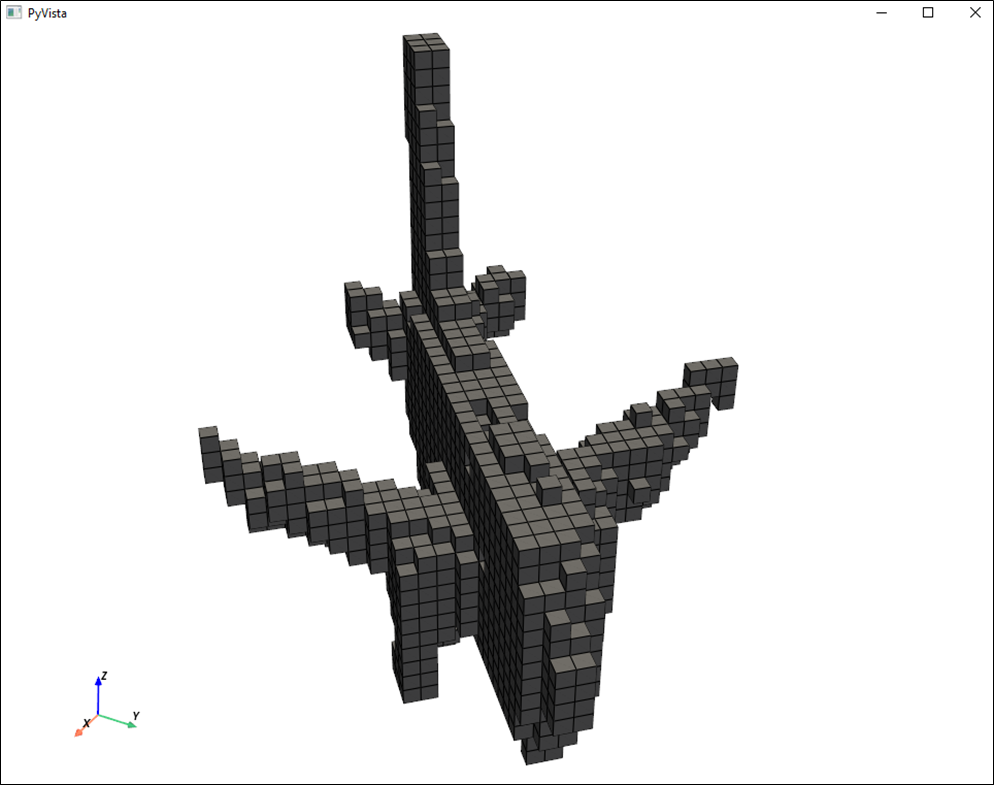
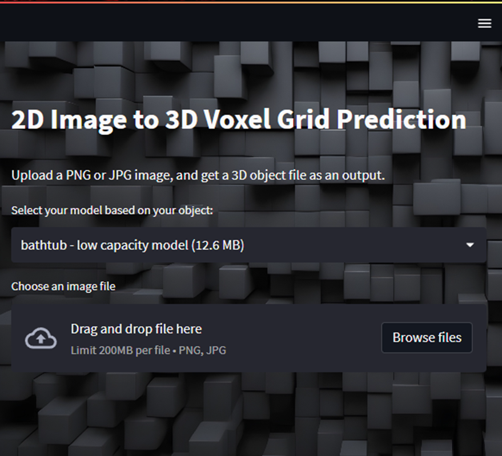
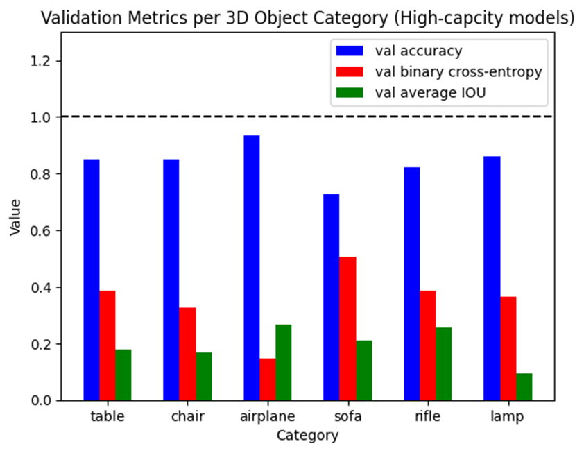

<a name="readme-top"></a>

<!-- PROJECT LOGO -->
<br />
<div align="center">
  <a href="https://github.com/ErnieSumoso/3d-shape-reconstruction">
    
  </a>

<h3 align="center">Deep Learning for Shape Reconstruction: Converting 2D Images into 3D Voxel Grids Using ShapeNet Data</h3>
<b>### Final version - no additional updates planned ###</b> <br><br>
  This tool can be used to predict 3D object shapes based on 2D images, scoped to 55 specific object categories (e.g. chairs, tables, airplanes, etc.).
  The final product, a web app, enables users to upload images, chose a CNN model for processing, and visualize the 3D predictions, with the possibility to download the results as OBJ files.
  <p align="center">
    <br />
    <a href="https://github.com/ErnieSumoso/3d-shape-reconstruction/pulls">Pull Requests</a>
    ·
    <a href="https://github.com/ErnieSumoso/3d-shape-reconstruction/issues">Issues</a>
  </p>
</div>


## About The Project

This repository demonstrates a complete deep learning pipeline for predicting 3D voxel grids from 2D images.
I designed and implemented a data processing pipeline to convert 48,000 3-dimensional objects from the ShapeNet Core dataset, stored as OBJ files, into voxel grids (32×32×32), structured as NumPy arrays for efficient model training.
Then thousands of images are rendered from these 3D objects, which are then used to train CNNs, 1 for each object category.
This project covers:
<li> Converting 3D models from ShapeNet (OBJ format) to voxel grids </li> 
<li> Rendering images using the Stanford ShapeNet Renderer and Blender </li> 
<li> Preprocessing and organizing the dataset as NumPy arrays </li> 
<li> Training high-capacity and low-capacity CNN models </li> 
<li> Evaluating predictions using the IoU metric and visual inspections </li> 
<li> Hosting a small Streamlit web app (locally) to perform interactive 3D predictions </li>
<br>
<div align="center">
  
</div>
<p align="right">(<a href="#readme-top">back to top</a>)</p>


### Built With

* [![Python 3][python-badge]][python-url]
* [![Streamlit][streamlit-badge]][streamlit-url]
* [![Tensorflow][tensorflow-badge]][tensorflow-url]
* [![Matplotlib][matplotlib-badge]][matplotlib-url]
* [![PyVista][pyvista-badge]][pyvista-url]
* [![Numpy][numpy-badge]][numpy-url]
* [![JupyterLab][jupyter-badge]][jupyter-url]
* [![Stanford Shapenet Renderer][ssr-badge]][ssr-url]

<p align="right">(<a href="#readme-top">back to top</a>)</p>


## Getting Started

### Prerequisites

To run the code you need to have Python 3 installed on your computer. JupyterLab (or Notebook) is optional for exploring the notebook.
* [Python 3+](https://www.python.org/downloads/)
* [JupyterLab 4.0+](https://jupyter.org/install) or Jupyer Notebook

### Installation

1. Clone the repo
   ```sh
   git clone https://github.com/ErnieSumoso/3d-object-reconstruction.git
   ```
2. Navigate to the project directory:
   ```sh
   cd 3d-object-reconstruction
   ```
3. (Recommended) Create and activate a virtual environment:
   ```sh
   python -m venv venv
   source venv/bin/activate        # On macOS/Linux
   .\venv\Scripts\activate         # On Windows
   ```
4. Install the required dependencies:
   ```sh
   pip install -r requirements.txt
   ```
5. (Optional) Run JupyterLab or Jupyter Notebook to explore the notebook:
   ```sh
   jupyter lab
   ```
6. Download the pretrained models:
   ```sh
   python download_models.py
   ```
7. Launch the Streamlit web app:
   ```sh
   streamlit run app.py
   ```
<p align="right">(<a href="#readme-top">back to top</a>)</p>


## Usage and Details

You can explore the Jupyter notebooks to reproduce results, train new models; or you can host the web app in your local to interact by using your own 2D input images.
More details about the development:
<li> Customized the Stanford ShapeNet Renderer (SSR) code, an image rendering pipeline that works with Blender, generating 500,000 images for CNN training. </li> 
<li> Developed an automated pipeline to convert 500,000 rendered images into structured NumPy arrays (NPY) for efficient deep learning model training. </li> 
<li> Used Pillow for grayscale conversion, resized images to (128, 128), and organized data into category-based for optimized retrieval. </li> 
<li> Implemented a class imbalance mitigation strategy by segmenting categories into high and low-capacity subsets, adapting CNN architectures accordingly. </li> 
<li> Designed and trained 6 high-capacity CNN models using Keras, incorporating 2D & 3D convolutional layers, dense layers, and reshaping techniques, resulting in 570 million model parameters. </li> 
<li> Used an ADAM optimizer, Binary Cross-Entropy loss, Early Stopping and Model Checkpoints to enhance performance & prevent overfitting. </li> 
<li> Evaluated model performance using Intersection Over Union (IoU) metric to measure the accuracy of predicted voxels, alongside visual comparisons (quant. and qual. assessments) on unseen data. </li> 
<li> Engineered 11 low-capacity CNN models for categories with less data, using techniques like node dropouts and L2 regularization to prevent overfitting. </li> 
<li> Developed a simple web application using Streamlit (front-end), PyVista (3D visualizations), and Google Drive (model file hosting). </li> 
<br>
<div align="center">
  
</div>

<p align="right">(<a href="#readme-top">back to top</a>)</p>


## Roadmap

- [✓] Host models on Google Drive for user download (not available anymore).
- [✓] Complete the development of the web app interface using Streamlit.
- [✓] Update the README file and final project update.

I am always open to suggestions and solving issues. Please, add them on the [issues section](https://github.com/ErnieSumoso/3d-shape-reconstruction/issues).

<p align="right">(<a href="#readme-top">back to top</a>)</p>

<!-- CONTACT -->
## Contact

Ernie Sumoso - [GitHub Profile](https://github.com/ErnieSumoso)

<!-- MARKDOWN LINKS & IMAGES -->
<!-- https://www.markdownguide.org/basic-syntax/#reference-style-links -->
[python-badge]: https://img.shields.io/badge/python-3670A0?style=for-the-badge&logo=python&logoColor=ffdd54
[python-url]: https://www.python.org/
[streamlit-badge]: https://img.shields.io/badge/-Streamlit-FF4B4B?style=flat&logo=streamlit&logoColor=white
[streamlit-url]: https://docs.streamlit.io/
[tensorflow-badge]: https://img.shields.io/badge/TensorFlow-FF3F06?style=for-the-badge&logo=tensorflow&logoColor=white
[tensorflow-url]: https://www.tensorflow.org/api_docs
[matplotlib-badge]: https://img.shields.io/badge/-Matplotlib-000000?style=flat&logo=python
[matplotlib-url]: https://matplotlib.org/stable/index.html
[jupyter-badge]: https://img.shields.io/badge/jupyter-book-orange?logo=data:image/png;base64,iVBORw0KGgoAAAANSUhEUgAAABwAAAAZCAMAAAAVHr4VAAAAXVBMVEX////v7+/zdybv7+/zdybv7+/zdybv7+/zdybv7+/zdybv7+/zdybv7+/zdybv7+/zdybv7+/zdybv7+/v7+/zdybv7+/zdybv7+/v7+/zdybv7+/zdybv7+/zdyaSmqV2AAAAHXRSTlMAEBAgIDAwQEBQUGBgcHCAgJCQoLCwwMDQ4ODw8MDkUIUAAADJSURBVHjaddAFkgNBCAXQP+7uAvc/5tLFVseYF8crUB0560r/5gwvjYYm8gq8QJoyIJNwlnUH0WEnART6YSezV6c5tjOTaoKdfGXtnclFlEBEXVd8JzG4pa/LDql9Jff/ZCC/h2zSqF5bzf4vqkgNwEzeClUd8uMadLE6OnhBFsES5niQh2BOYUqZsfGdmrmbN+TMvPROHUOkde8sEs6Bnr0tDDf2Roj6fmVfubuGyttejCeLc+xFm+NLuLnJeFAyl3gS932MF/wBoukfUcwI05kAAAAASUVORK5CYII=
[jupyter-url]: https://jupyter.org/
[pyvista-badge]: https://img.shields.io/badge/pyvista-green
[pyvista-url]: https://docs.pyvista.org/
[numpy-badge]: https://img.shields.io/badge/numpy-blue
[numpy-url]: https://numpy.org/doc/
[ssr-badge]: https://img.shields.io/badge/stanford_shapenet_renderer-purple
[ssr-url]: https://github.com/panmari/stanford-shapenet-renderer
